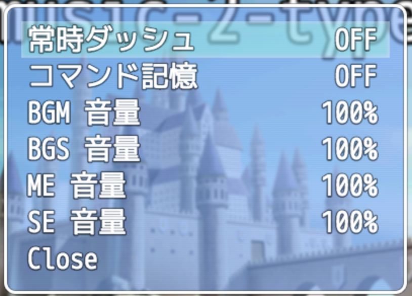

# RPGツクールMV用プラグイン : 「オプション」を閉じる選択肢を追加

RPG Maker MV Plugin - HTN_CloseOptionsWindowCommand

## ダウンロード

**[ここを右クリックして「名前を付けてリンク先を保存」みたいな項目を選んでダウンロード](https://raw.githubusercontent.com/nekonenene/RPG-Maker-MV_CloseOptionsWindowCommand/master/HTN_CloseOptionsWindowCommand.js)**

ダウンロードした `HTN_CloseOptionsWindowCommand.js` を `js/plugins` フォルダーの中に入れてください。

プラグインの導入方法について詳しくは、ツクール公式サイトの講座ページをご覧ください！ ↓  
[RPGツクールMV 初心者講座 プラグイン編](https://tkool.jp/mv/guide/011_001.html)

## プラグイン説明

こんなふうに、一番下に「Close」という選択肢が足されます。  
「Close」以外の好きな言葉にプラグイン管理画面から変えられますので、作成しているゲームの雰囲気に合わせた言葉にしてくださいね。

## 作者情報

ハトネコエ  
**[Twitter : @nekonenene](https://twitter.com/nekonenene)**  
HP : http://hato-neko.x0.com/

バグ報告や要望など、ぜひぜひ [Twitter](https://twitter.com/nekonenene) や [GitHub issue](https://github.com/nekonenene/RPG-Maker-MV_CrossFadeBgm/issues) にお寄せください。
